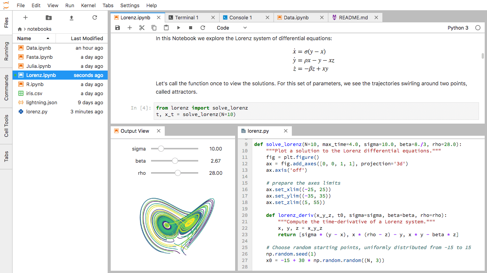

<!--
Este archivo README esta generado automaticamente<https://github.com/YunoHost/apps/tree/master/tools/readme_generator>
No se debe editar a mano.
-->

# JupyterLab para Yunohost

[](https://dash.yunohost.org/appci/app/jupyterlab)  

[](https://install-app.yunohost.org/?app=jupyterlab)

*[Leer este README en otros idiomas.](./ALL_README.md)*

> *Este paquete le permite instalarJupyterLab rapidamente y simplement en un servidor YunoHost.*  
> *Si no tiene YunoHost, visita [the guide](https://yunohost.org/install) para aprender como instalarla.*

## Descripción general

JupyterLab is the next-generation user interface for Project Jupyter offering all the familiar building blocks of the classic Jupyter Notebook (notebook, terminal, text editor, file browser, rich outputs, etc.) in a flexible and powerful user interface. JupyterLab will eventually replace the classic Jupyter Notebook.


**Versión actual:** 4.1.5~ynh1

**Demo:** <https://mybinder.org/v2/gh/jupyterlab/jupyterlab-demo/master?urlpath=lab/tree/demo>

## Capturas



## Documentaciones y recursos

- Sitio web oficial: <https://jupyter.org>
- Documentación administrador oficial: <https://jupyterlab.readthedocs.io/en/stable/>
- Repositorio del código fuente oficial de la aplicación : <https://github.com/jupyterhub/jupyterhub>
- Catálogo YunoHost: <https://apps.yunohost.org/app/jupyterlab>
- Reportar un error: <https://github.com/YunoHost-Apps/jupyterlab_ynh/issues>

## Información para desarrolladores

Por favor enviar sus correcciones a la [`branch testing`](https://github.com/YunoHost-Apps/jupyterlab_ynh/tree/testing

Para probar la rama `testing`, sigue asÍ:

```bash
sudo yunohost app install https://github.com/YunoHost-Apps/jupyterlab_ynh/tree/testing --debug
o
sudo yunohost app upgrade jupyterlab -u https://github.com/YunoHost-Apps/jupyterlab_ynh/tree/testing --debug
```

**Mas informaciones sobre el empaquetado de aplicaciones:** <https://yunohost.org/packaging_apps>
